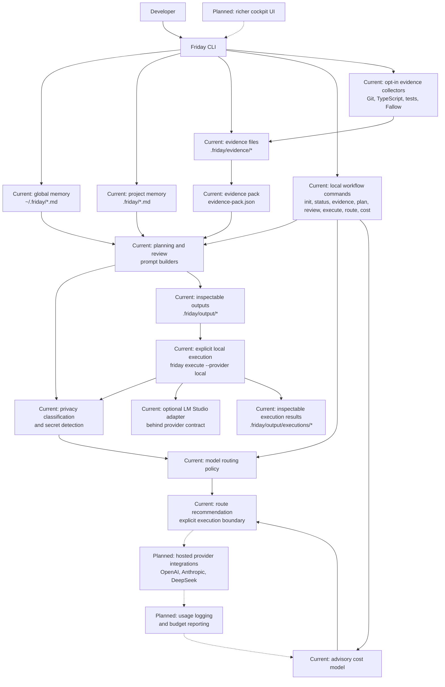

# Architecture

Friday is a local, CLI-first TypeScript application. The architecture separates
project memory, deterministic evidence, prompt construction, privacy policy,
model routing, cost estimation, provider contracts, and command handling.

That separation is intentional: the current app can produce useful local
artefacts without provider execution, while future model calls can be added
behind the existing safety and routing boundaries.

## Architecture Diagram

Solid arrows show the current local-first workflow. Dotted arrows show optional
or planned extensions. The current CLI builds local artefacts, loads global and
project memory, classifies privacy risk, detects common secrets, recommends
model routes, and estimates cost advisorially. Model calls happen only through
the explicit `friday execute --provider local` boundary; the CLI does not load
provider API keys, invoke hosted providers, upload telemetry, or provide a
cockpit UI. Local execution metadata can be appended under
`.friday/runtime/execution-log.jsonl` for routing and outcome analysis. The
provider layer includes an optional LM Studio adapter that can be invoked
explicitly behind the same routing and privacy boundaries.

## Implemented Commands

- `friday init` creates the standard `.friday/` project-memory files.
- `friday status` reports whether the expected project-memory files exist.
- `friday evidence` prepares `.friday/evidence/` files and writes an
  inspectable `evidence-pack.json`.
- `friday plan <goal...>` writes `.friday/output/plan-prompt.md` from optional
  global memory, local project memory, and manual evidence.
- `friday review --changed` writes `.friday/output/review-prompt.md` from git
  changed-file context, optional global memory, project memory, and manual
  evidence.
- `friday route` previews the recommended model route without reading project
  files or calling a provider.
- `friday cost` estimates advisory provider/model cost from estimated token
  counts and built-in pricing.
- `friday execute <prompt-path> --provider local` executes an existing generated
  prompt through the explicit local provider boundary and writes an inspectable
  execution result.

## Core Modules

- `src/core/` owns global and project memory file names, project templates,
  status inspection, memory loading, merge rules, and file-system helpers.
- `src/cli/commands/` owns command parsing and workflow orchestration.
- `src/ai/evidence/` owns evidence types, provider file names, templates,
  placeholder filtering, manual evidence parsing, and evidence-pack generation.
- `src/ai/planning/` owns provider-neutral planning prompt construction.
- `src/ai/review/` owns provider-neutral review prompt construction.
- `src/ai/privacy/` owns deterministic privacy classification and secret
  detection.
- `src/ai/routing/` owns model-route vocabulary, pure route policy, and composed
  privacy-plus-routing recommendations.
- `src/ai/pricing/` owns advisory model cost estimation from token counts and
  per-million token prices.
- `src/ai/providers/` owns provider-neutral model contracts, the mock provider,
  and the optional LM Studio local provider adapter.
- `src/ai/usage/` owns the local execution log schema, append/read helpers, and
  summary helpers for workflow, provider/model, retry, and escalation counts.

## Current Data Flow

`friday plan` and `friday review` are local prompt builders. They load optional
global memory from `~/.friday/`, project memory from `repo/.friday/`, and
evidence, format inspectable Markdown prompts, write generated outputs under
`.friday/output/`, and print a local AI policy summary with privacy, route, and
advisory cost information.

Global memory is loaded in a fixed order:

1. `profile.md`
2. `coding-standards.md`
3. `privacy-policy.md`
4. `model-policy.md`
5. `cost-policy.md`

Global memory is not mandatory. Missing files are reported but do not block the
workflow. During prompt construction, global sections are placed before project
sections and exact duplicate content is included once. Global policy establishes
the minimum privacy floor: project memory may strengthen the effective privacy
classification, but it cannot weaken a stricter global secret or privacy
restriction.

`friday evidence` is local and deterministic. It prepares provider files for
manual evidence, can collect Git, TypeScript, test, and Fallow evidence with
`--collect`, and normalises existing contents into an evidence pack.

`friday route` is pure policy. It accepts explicit task and privacy inputs, then
prints a route recommendation, warnings, and alternatives. It does not execute
the recommendation.

`friday cost` is advisory. It accepts explicit provider, model, and estimated
token counts, then prints deterministic input, output, and total cost estimates.

`friday execute` is the only model-calling command. It reads an existing prompt
artefact, re-runs privacy and secret classification, routes with hosted models
disabled, requires `--provider local`, checks local provider availability, and
writes a separate execution result under `.friday/output/executions/`.

## Boundaries

- Global memory is reusable developer context and policy.
- Project memory is human-maintained source context.
- Generated prompts and evidence packs are derived artefacts.
- Evidence providers are deterministic sources of facts, not AI providers.
- Routing and cost estimation remain advisory around execution and until usage
  logging exists.
- Real model execution must stay behind privacy classification, secret
  detection, routing policy, cost policy, and explicit provider configuration.
- LM Studio execution is optional, local-only, and available only through the
  explicit `friday execute --provider local` boundary or code paths that
  explicitly construct the adapter with a base URL and model.

## Planned Architecture Work

- Add usage logging and budget reporting.
- Add hosted provider implementations behind the provider contracts.
