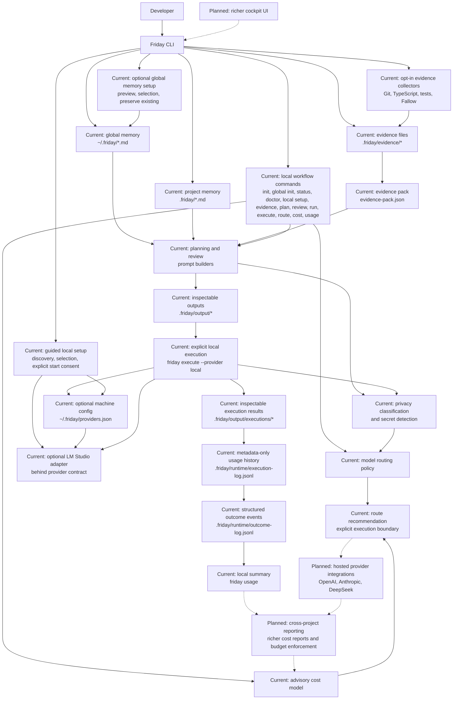

# Architecture

Friday is a local, CLI-first TypeScript application. The architecture separates
project memory, deterministic evidence, prompt construction, privacy policy,
model routing, cost estimation, provider contracts, and command handling.

That separation is intentional: the current app can produce useful local
artefacts without provider execution and can explicitly invoke a configured
localhost LM Studio model behind the same safety and routing boundaries. Hosted
model calls remain a future extension.

## Architecture Diagram

Solid arrows show the current local-first workflow. Dotted arrows show optional
or planned extensions. The current CLI builds local artefacts, loads global and
project memory, classifies privacy risk, detects common secrets, recommends
model routes, and estimates cost advisorially. Workflow model calls happen through
the explicit `friday execute --provider local` boundary, while guided setup can
send an optional verification request; the CLI does not load
provider API keys, invoke hosted providers, upload telemetry, or provide a
cockpit UI. Local execution metadata can be appended under
`.friday/runtime/execution-log.jsonl` for routing and outcome analysis. The
provider layer includes optional machine-level configuration, localhost
discovery, deterministic loaded-model selection, and an LM Studio adapter behind
the same routing and privacy boundaries.
Hosted-provider execution remains planned and outside the current product.

## Implemented Commands

- `friday init` creates the standard `.friday/` project-memory files.
- `friday global init` previews minimal reusable preferences and policies, then
  creates selected missing `~/.friday/*.md` files without overwriting existing
  memory. Non-interactive setup requires `--minimal --yes`.
- `friday status` reports whether the expected project-memory files exist.
- `friday doctor [--test-provider]` reports runtime, memory, configuration, and
  local-provider readiness without changing setup.
- `friday local setup` discovers LM Studio, selects a loaded model, saves global
  provider configuration, and optionally verifies generation. Server startup
  requires prompt confirmation or `--start-server`.
- `friday evidence` prepares `.friday/evidence/` files and writes an
  inspectable `evidence-pack.json`.
- `friday plan <goal...>` writes `.friday/output/plan-prompt.md` from optional
  global memory, local project memory, and manual evidence.
- `friday review --changed` writes `.friday/output/review-prompt.md` from git
  changed-file context, optional global memory, project memory, and manual
  evidence.
- `friday run plan <goal...>` and `friday run review --changed` reuse those
  prompt builders, run the shared local execution preflight, require approval,
  and write the existing result and usage artefacts.
- `friday route` previews the recommended model route without reading project
  files or calling a provider.
- `friday cost` estimates advisory provider/model cost from estimated token
  counts and built-in pricing.
- `friday usage` reads metadata-only local execution history and reports recorded
  token totals, advisory cost, outcomes, and workflow/provider-model counts.
- `friday execute <prompt-path> --provider local` executes an existing generated
  prompt through the explicit local provider boundary and writes an inspectable
  execution result.

## Core Modules

- `src/core/` owns global and project memory file names, project templates,
  status inspection, memory loading, merge rules, and file-system helpers.
- `src/cli/commands/` owns command parsing and workflow orchestration.
- `src/ai/evidence/` owns evidence types, provider file names, templates,
  placeholder filtering, manual evidence parsing, and evidence-pack generation.
- `src/ai/planning/` owns provider-neutral planning prompt construction.
- `src/ai/review/` owns provider-neutral review prompt construction.
- `src/ai/privacy/` owns deterministic privacy classification and secret
  detection.
- `src/ai/routing/` owns model-route vocabulary, pure route policy, and composed
  privacy-plus-routing recommendations.
- `src/ai/pricing/` owns advisory model cost estimation from token counts and
  per-million token prices.
- `src/ai/providers/` owns provider-neutral model contracts, the mock provider,
  global provider configuration, local service discovery and selection, and the
  optional LM Studio local provider adapter.
- `src/ai/usage/` owns the local execution log schema, append/read helpers, and
  summary helpers for workflow, provider/model, retry, and escalation counts.

## Current Data Flow

`friday plan` and `friday review` are local prompt builders. They load optional
global memory from `~/.friday/`, project memory from `repo/.friday/`, and
evidence, format inspectable Markdown prompts, write generated outputs under
`.friday/output/`, and print a local AI policy summary with privacy, route, and
advisory cost information.

Global memory is loaded in a fixed order:

1. `profile.md`
2. `coding-standards.md`
3. `privacy-policy.md`
4. `model-policy.md`
5. `cost-policy.md`

Global memory is not mandatory. Missing files are reported but do not block the
workflow. During prompt construction, global sections are placed before project
sections and exact duplicate content is included once. Global policy establishes
the minimum privacy floor: project memory may strengthen the effective privacy
classification, but it cannot weaken a stricter global secret or privacy
restriction.

`friday global init` is the optional global-memory preparation boundary. It
offers local minimal templates, previews selected content, requires confirmation
before interactive writes, and preserves every existing memory file. It neither
calls a model nor changes `providers.json`.

`friday evidence` is local and deterministic. It prepares provider files for
manual evidence, can collect Git, TypeScript, test, and Fallow evidence with
`--collect`, and normalises existing contents into an evidence pack.

`friday route` is pure policy. It accepts explicit task and privacy inputs, then
prints a route recommendation, warnings, and alternatives. It does not execute
the recommendation.

`friday cost` is advisory. It accepts explicit provider, model, and estimated
token counts, then prints deterministic input, output, and total cost estimates.

`friday usage` is a local, deterministic, read-only reporting boundary. It reads
`.friday/runtime/execution-log.jsonl` through the usage-domain helpers, can filter
by completion time, and groups records by workflow or provider/model. It reports
real recorded token usage alongside advisory cost totals without printing prompts,
responses, secrets, or private snippets. A missing log is treated as empty history.

`friday run` is the convenience orchestration boundary. It prepares the normal
plan or review prompt, resolves the configured or explicitly overridden LM
Studio model, reuses the execution safety and cost preflight, prints the route
summary and expected output location, then requires interactive confirmation or
`--yes` before invoking the provider.

`friday execute` is the workflow model-calling command. It reads an existing prompt
artefact, re-runs privacy and secret classification, routes with hosted models
disabled, requires `--provider local`, loads optional configuration from
`~/.friday/providers.json`, discovers LM Studio at common localhost endpoints,
selects a loaded model, and writes a separate execution result under
`.friday/output/executions/`. Successful and failed attempts append metadata-only
records to `.friday/runtime/execution-log.jsonl`; raw prompts, secrets, hidden
reasoning, and unredacted provider responses are excluded from that history.
Workflow-specific output-token defaults leave room for reasoning models, and an
implicit ceiling may trigger one bounded retry within known context limits.

`friday local setup` is the machine-configuration boundary. It validates local
endpoint settings, discovers loaded LM Studio models, resolves one model through
automatic or interactive selection, and writes `~/.friday/providers.json` for
later `doctor` and `execute` commands. It can make an explicit lightweight test
request. It never downloads models, and it runs `lms server start` only after an
interactive confirmation or an explicit `--start-server` flag.

## Boundaries

- Global memory is reusable developer context and policy.
- Global provider configuration is optional machine state and is never merged
  into project memory or prompt context.
- Project memory is human-maintained source context.
- Generated prompts, execution results, evidence packs, and runtime logs are
  derived local artefacts. Live generated files are ignored by default; curated,
  redacted `*.example.md` artefacts may be committed as documentation.
- Evidence providers are deterministic sources of facts, not AI providers.
- Routing and cost estimation remain advisory around execution. Metadata-only
  local usage logging and per-project summaries exist, but cross-project reporting
  and budget enforcement do not.
- Real model execution must stay behind privacy classification, secret
  detection, routing policy, cost policy, and explicit provider configuration.
- LM Studio execution is optional and local-only. It is available through the
  inspect-first `friday execute --provider local` boundary or the explicit
  approval boundary in `friday run`; discovery does not download models or start
  processes.

## Planned Architecture Work

- Add cross-project reporting, richer cost reports, and budget enforcement on top
  of implemented metadata-only local execution history and summaries.
- Add hosted provider implementations behind the provider contracts.
