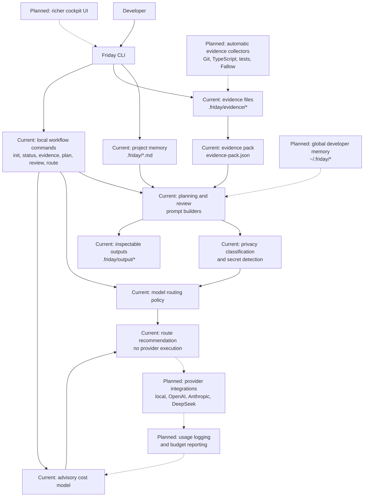

# Architecture

Friday is a local, CLI-first TypeScript application. The architecture separates
project memory, deterministic evidence, prompt construction, privacy policy,
model routing, cost estimation, provider contracts, and command handling.

That separation is intentional: the current app can produce useful local
artefacts without provider execution, while future model calls can be added
behind the existing safety and routing boundaries.

## Architecture Diagram

Solid arrows show the current local-first workflow. Dotted arrows show planned
extensions. The current system builds local artefacts, classifies privacy risk,
detects common secrets, recommends model routes, and estimates cost
advisorially; it does not execute model calls, load provider API keys, log real
usage, or provide a cockpit UI.

## Implemented Commands

- `friday init` creates the standard `.friday/` project-memory files.
- `friday status` reports whether the expected project-memory files exist.
- `friday evidence` prepares `.friday/evidence/` files and writes an
  inspectable `evidence-pack.json`.
- `friday plan <goal...>` writes `.friday/output/plan-prompt.md` from local
  project memory and manual evidence.
- `friday review --changed` writes `.friday/output/review-prompt.md` from git
  changed-file context, project memory, and manual evidence.
- `friday route` previews the recommended model route without reading project
  files or calling a provider.

## Core Modules

- `src/core/` owns project memory file names, templates, status inspection,
  memory loading, and file-system helpers.
- `src/cli/commands/` owns command parsing and workflow orchestration.
- `src/ai/evidence/` owns evidence types, provider file names, templates,
  placeholder filtering, manual evidence parsing, and evidence-pack generation.
- `src/ai/planning/` owns provider-neutral planning prompt construction.
- `src/ai/review/` owns provider-neutral review prompt construction.
- `src/ai/privacy/` owns deterministic privacy classification and secret
  detection.
- `src/ai/routing/` owns model-route vocabulary, pure route policy, and composed
  privacy-plus-routing recommendations.
- `src/ai/pricing/` owns advisory model cost estimation from token counts and
  per-million token prices.
- `src/ai/providers/` owns provider-neutral model contracts and the mock provider.

## Current Data Flow

`friday plan` and `friday review` are local prompt builders. They load project
memory and evidence, format inspectable Markdown prompts, and write generated
outputs under `.friday/output/`.

`friday evidence` is local and deterministic. It prepares provider files for
manual or future collected evidence and normalises existing contents into an
evidence pack.

`friday route` is pure policy. It accepts explicit task and privacy inputs, then
prints a route recommendation, warnings, and alternatives. It does not execute
the recommendation.

## Boundaries

- Project memory is human-maintained source context.
- Generated prompts and evidence packs are derived artefacts.
- Evidence providers are deterministic sources of facts, not AI providers.
- Routing and cost estimation are advisory until execution and usage logging
  exist.
- Real model execution must stay behind privacy classification, secret
  detection, routing policy, cost policy, and explicit provider configuration.

## Planned Architecture Work

- Compose privacy classification, route recommendation, and cost estimates into
  `plan` and `review` command output.
- Add automatic deterministic evidence collection for Git, TypeScript, tests,
  and Fallow.
- Add usage logging and budget reporting.
- Add real local and hosted provider implementations behind the provider
  contracts.
